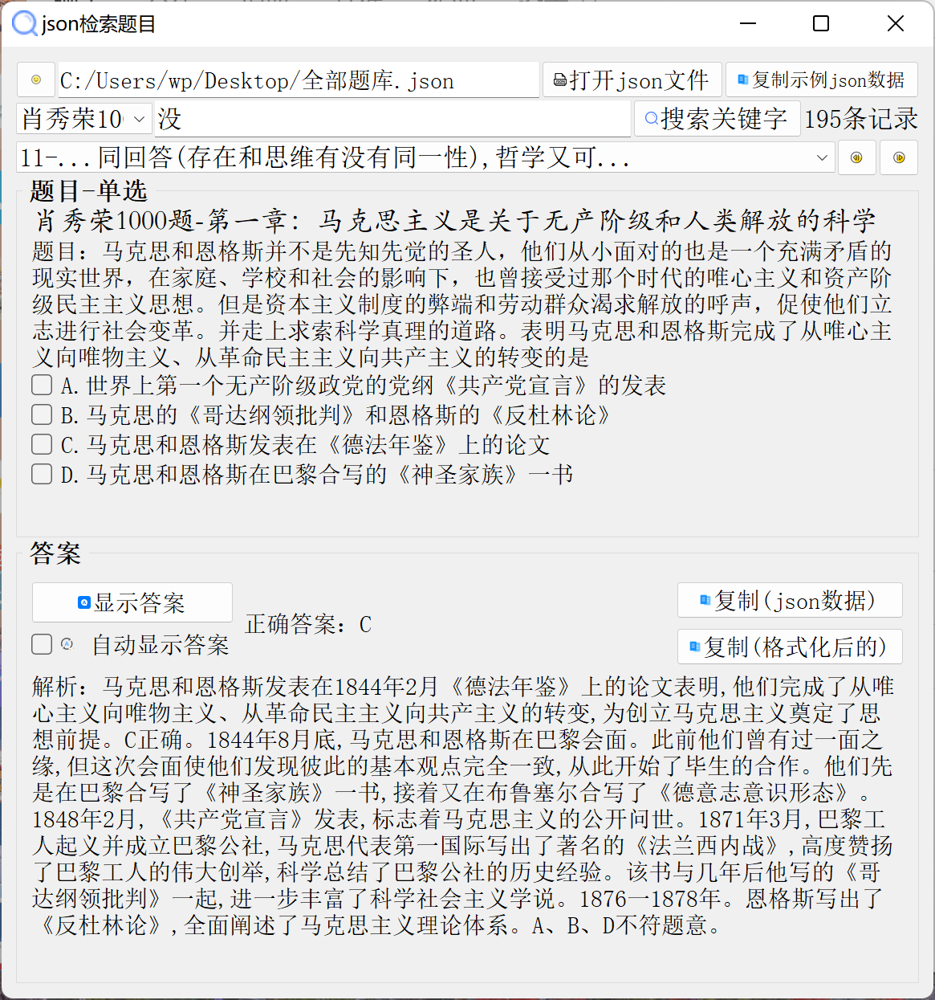
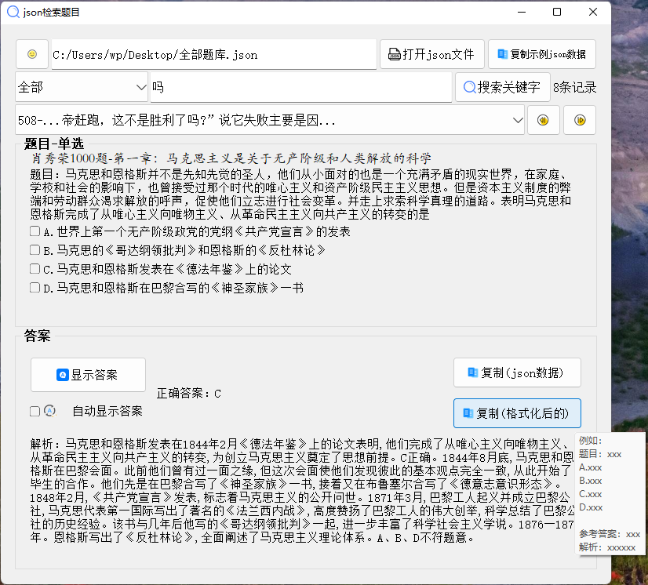
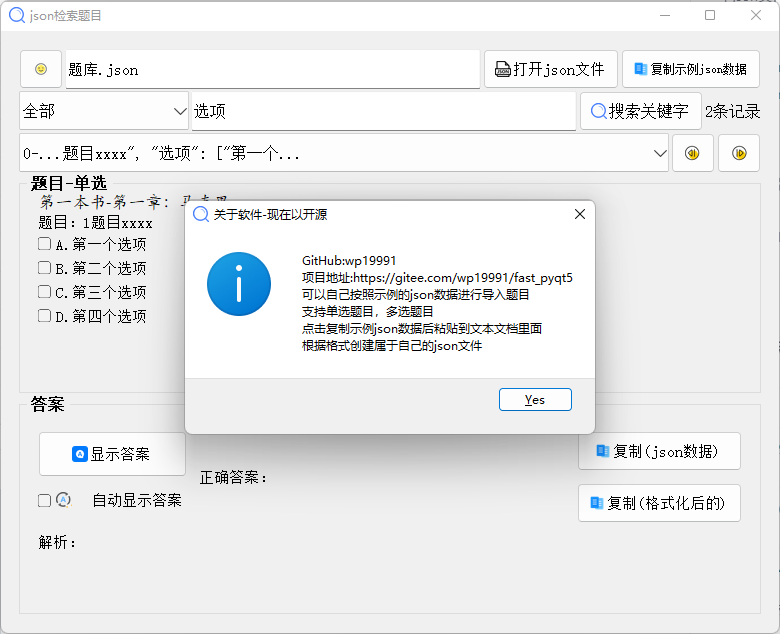
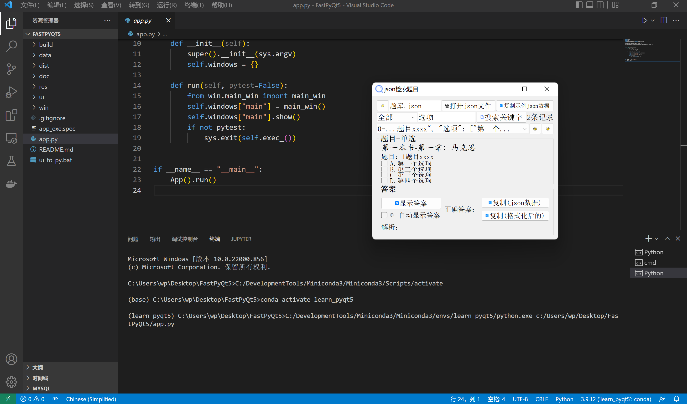

## fast_pyqt5
- 快速启动并开始编写pyqt5
- 这里的例子是写一个json文件解析器,json文件的例子可以看`./data/sample.json`

## 项目截图




## 启动项目
```bash
# 创建conda环境
conda create -n learn_pyqt5 python=3.9
# 激活conda环境
conda activate learn_pyqt5
# 安装库文件
pip install pyqt5 pyqt5-tools pyinstaller
# 运行项目
python app.py
# 进行单文件打包
pyinstaller app_exe.spec
# 修改ui_to_py.bat里面的conda环境地址，如果你打算开始写项目的话
```

